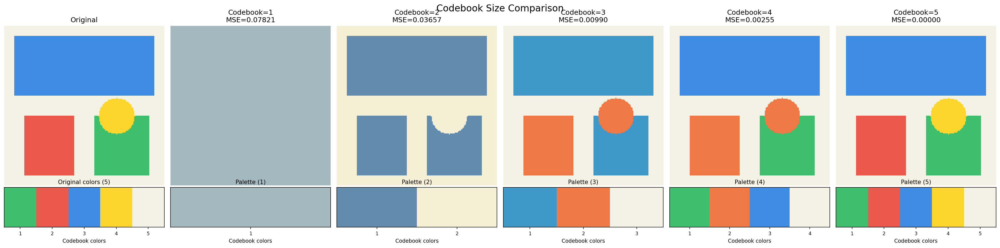
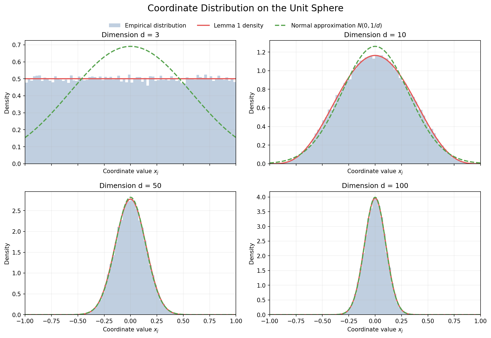
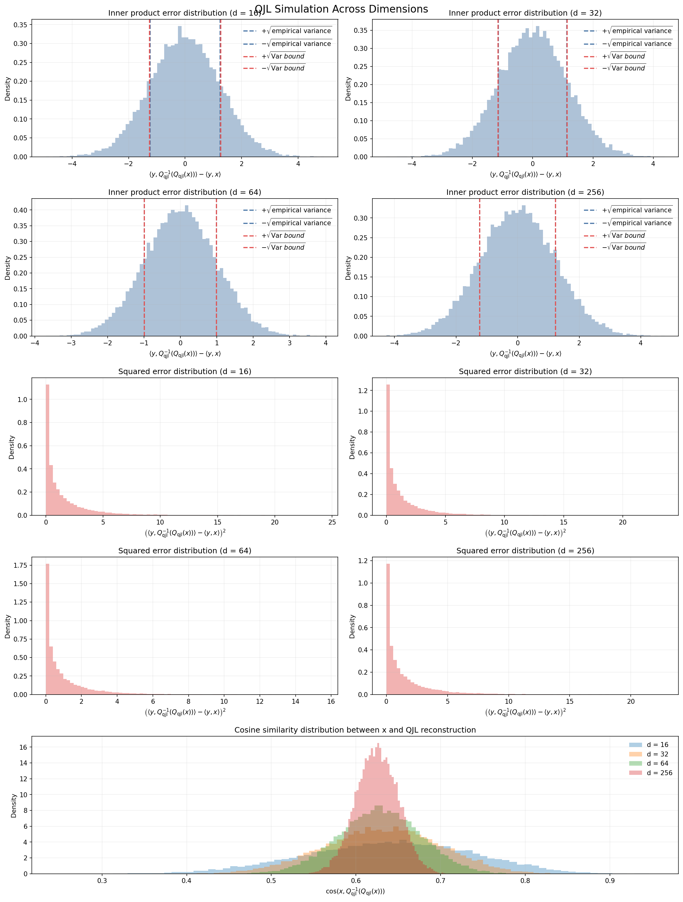
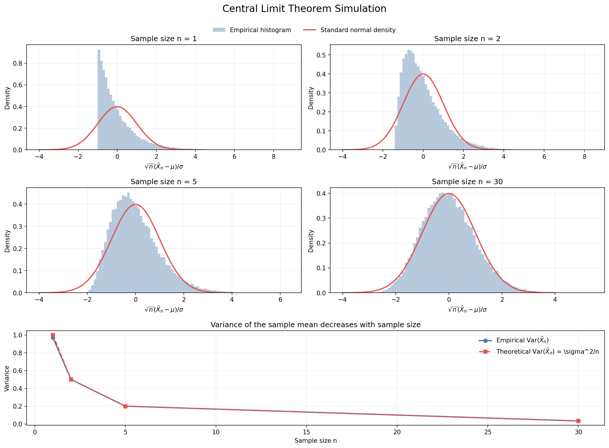
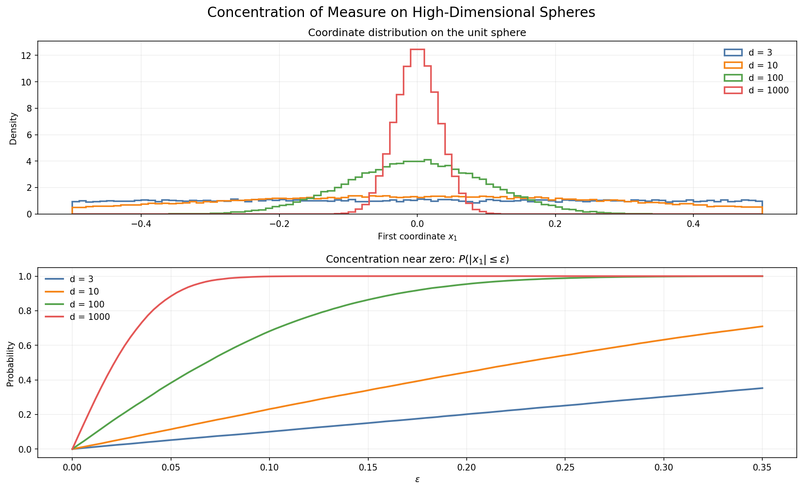
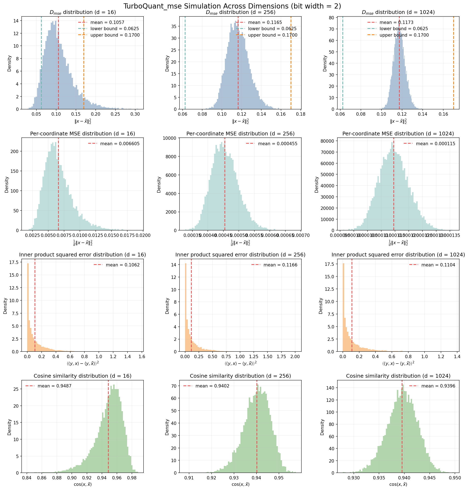
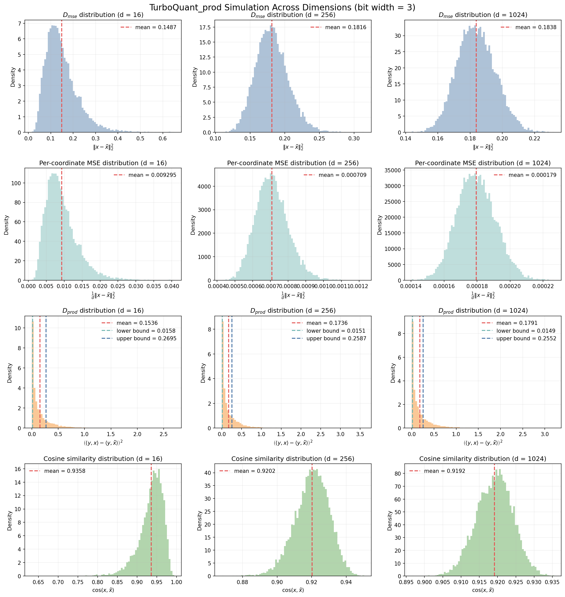
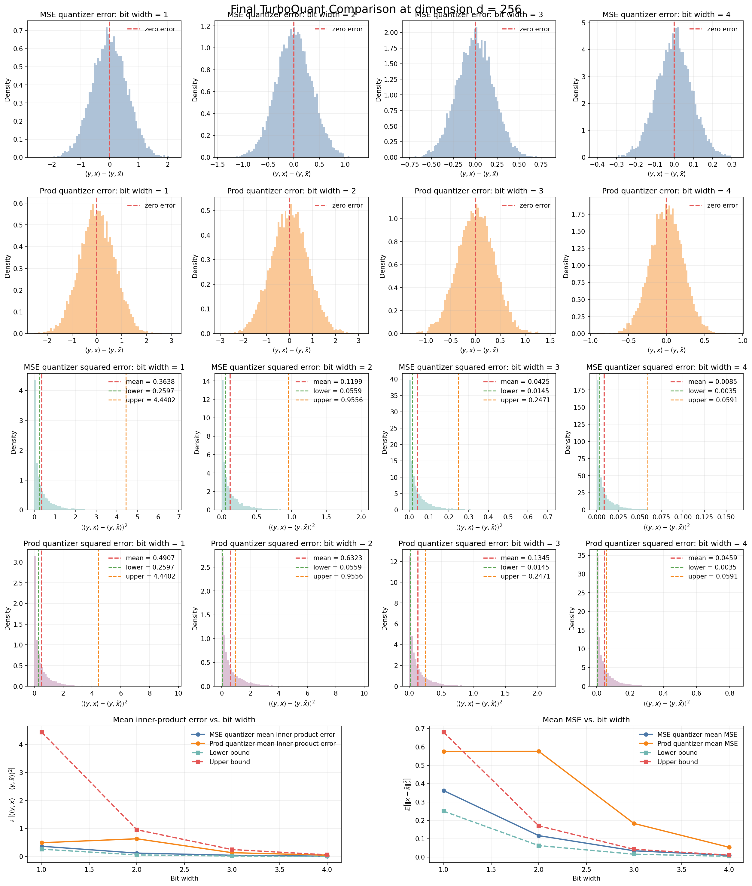

# TurboQuant_practice

TurboQuant_practice

TurboQuant paper: [https://arxiv.org/abs/2504.19874](https://arxiv.org/abs/2504.19874)

## Lemma 1 Explanation

Lemma 1 in `TurboQuant/main.tex` states the following:

- if $x \in S^{d-1}$ is uniformly distributed on the unit sphere in $R^d$
- then any coordinate $x_j$ follows a Beta-type distribution on $[-1, 1]$

The formula in the paper is:

$$
f_X(x) =
\frac{\Gamma(d/2)}{\sqrt{\pi}\,\Gamma((d-1)/2)}
(1-x^2)^{(d-3)/2}, \quad x \in [-1,1].
$$

The intuition is that if we fix one coordinate of a random point on the sphere to $x_j = x$, then the remaining coordinates must lie on a lower-dimensional sphere of radius $\sqrt{1-x^2}$. So the probability of observing a given coordinate value is determined by the size of that spherical cross-section.

## Definition of the Gamma Function

The Gamma function extends the factorial function to real and complex arguments:

$$
\Gamma(z) = \int_0^\infty t^{z-1} e^{-t} dt, \quad z > 0.
$$

Useful identities are:

- $\Gamma(z+1) = z \Gamma(z)$
- for any integer $n$, $\Gamma(n) = (n-1)!$
- $\Gamma(1/2) = \sqrt{\pi}$

This is why the Gamma function naturally appears in formulas for high-dimensional balls and spheres.

## Volume and Surface Area Formulas

The volume of a $d$-dimensional ball of radius $r$ is

$$
V_d(r) = \frac{\pi^{d/2}}{\Gamma(d/2 + 1)} r^d
$$

and the surface area of the sphere $S^{d-1}$ of radius $r$ is

$$
A_{d-1}(r) = \frac{2\pi^{d/2}}{\Gamma(d/2)} r^{d-1}.
$$

In particular, for radius $1$:

- unit ball volume: $V_d(1) = \pi^{d/2} / \Gamma(d/2 + 1)$
- unit sphere surface area: $A_{d-1}(1) = 2\pi^{d/2} / \Gamma(d/2)$

The Gamma function appears in Lemma 1 because the proof computes the size of spherical cross-sections, and those cross-sections are lower-dimensional spheres whose surface area is given by the formula above.

## Proof Sketch for Lemma 1

The proof in the paper uses a cross-sectional area argument.

1. Fix $x_j = x$. Then the remaining $d-1$ coordinates must satisfy
   $x_1^2 + ... + x_{j-1}^2 + x_{j+1}^2 + ... + x_d^2 = 1 - x^2$.

2. Therefore, the feasible set is a sphere in $R^{d-1}$ with radius $\sqrt{1-x^2}$ and dimension $d-2$.

3. Its surface area is
   $A_{d-2}(\sqrt{1-x^2}) = \frac{2\pi^{(d-1)/2}}{\Gamma((d-1)/2)} (1-x^2)^{(d-2)/2}$.

4. The total sample space is the unit sphere $S^{d-1}$, whose surface area is
   $A_{d-1}(1) = \frac{2\pi^{d/2}}{\Gamma(d/2)}$.

5. The density is proportional to the ratio between the cross-sectional area and the total surface area. When expressing the density with respect to the coordinate $x$, an additional Jacobian factor
   $\frac{1}{\sqrt{1-x^2}}$
   appears. In the paper this is described as coming from the Pythagorean-theorem geometry.

6. Therefore,
   $f_X(x) = \frac{\frac{2\pi^{(d-1)/2}}{\Gamma((d-1)/2)} (1-x^2)^{(d-2)/2}}{\frac{2\pi^{d/2}}{\Gamma(d/2)}} \cdot \frac{1}{\sqrt{1-x^2}}$
   and simplifying gives
   $f_X(x) = \frac{\Gamma(d/2)}{\sqrt{\pi}\,\Gamma((d-1)/2)} (1-x^2)^{(d-3)/2}$.

So the key idea behind Lemma 1 is that the distribution of one coordinate of a random point on the sphere is determined by the size of the spherical slice at that coordinate value. As the dimension grows, this distribution becomes increasingly concentrated near zero, which is why it converges to $N(0, 1/d)$ in high dimensions.

## QJL Explanation

Definition 1 in `TurboQuant/main.tex` introduces QJL, short for Quantized Johnson-Lindenstrauss. It is a $1$-bit quantization map designed for inner product estimation.

The forward QJL map is

$$
Q_{\tt qjl}(\mathbf{x}) := \mathrm{sign}(\mathbf{S}\mathbf{x}), \quad \mathbf{x} \in \mathbb{R}^d,
$$

where $\mathbf{S} \in \mathbb{R}^{d \times d}$ is a random Gaussian matrix with i.i.d. entries drawn from $N(0,1)$, and the sign function is applied coordinate-wise. This means each coordinate of $\mathbf{S}\mathbf{x}$ is compressed to only one bit, namely $+1$ or $-1$.

The dequantization map is

$$
Q_{\tt qjl}^{-1}(\mathbf{z}) := \frac{\sqrt{\pi/2}}{d}\mathbf{S}^\top \mathbf{z}, \quad \mathbf{z} \in \{-1,+1\}^d.
$$

The role of QJL is the following:

- first apply a random Gaussian projection through $\mathbf{S}$
- then keep only the signs of the projected coordinates
- reconstruct a vector by multiplying the sign vector with $\mathbf{S}^\top$ and the scale factor $\sqrt{\pi/2}/d$

This is useful because it gives an extremely compact representation, only one bit per coordinate, while still preserving inner products in expectation. In the TurboQuant paper, QJL is used on the residual vector after MSE-oriented quantization so that the final estimator becomes unbiased for inner product queries.

Intuitively, QJL trades exact coordinate values for random signed sketches. The Gaussian projection spreads the information of the input vector across coordinates, and the sign operation keeps only coarse directional information. The specific dequantization scaling is chosen so that the reconstructed vector has the correct inner-product behavior on average.

The factor $\sqrt{\pi/2}/d$ is not arbitrary. It is the normalization needed to make the estimator unbiased. For a standard Gaussian random variable $g \sim N(0,1)$,

$$
\mathbb{E}[\mathrm{sign}(g) g] = \mathbb{E}[|g|] = \sqrt{\frac{2}{\pi}}.
$$

So when we form the dequantized vector using $\mathbf{S}^\top \mathbf{z}$, each coordinate contributes an extra factor of $\sqrt{2/\pi}$ in expectation. Also, because $\mathbf{S}$ has $d$ rows, summing over all rows introduces a factor of $d$. Therefore the raw quantity $\mathbf{S}^\top \mathrm{sign}(\mathbf{S}\mathbf{x})$ has expectation proportional to

$$
d \sqrt{\frac{2}{\pi}} \, \mathbf{x}.
$$

Multiplying by

$$
\frac{\sqrt{\pi/2}}{d}
$$

exactly cancels this factor, so the reconstruction is centered at the original vector in the sense needed for unbiased inner-product estimation. That is the reason the dequantization map uses the coefficient $\sqrt{\pi/2}/d$.

A more formal derivation is as follows. Let the rows of $\mathbf{S}$ be $\mathbf{s}_1, \dots, \mathbf{s}_d$, where each $\mathbf{s}_i \sim N(\mathbf{0}, I_d)$. Then

$$
\mathbf{S}^\top \\mathrm{sign}(\mathbf{S}\mathbf{x}) = \sum_{i=1}^d \mathbf{s}_i \\mathrm{sign}(\mathbf{s}_i^\top \mathbf{x}),
$$

so

$$
\mathbb{E}[\mathbf{S}^\top \\mathrm{sign}(\mathbf{S}\mathbf{x})] = d \, \mathbb{E}[\mathbf{s} \\mathrm{sign}(\mathbf{s}^\top \mathbf{x})].
$$

By rotational invariance of the Gaussian distribution, the vector

$$
\mathbb{E}[\mathbf{s} \\mathrm{sign}(\mathbf{s}^\top \mathbf{x})]
$$

must be parallel to $\mathbf{x}$, so for some scalar $c$,

$$
\mathbb{E}[\mathbf{s} \\mathrm{sign}(\mathbf{s}^\top \mathbf{x})] = c \mathbf{x}.
$$

To find $c$, take the inner product with $\mathbf{x}$. When $\|\mathbf{x}\|_2 = 1$,

$$
\mathbf{x}^\top \mathbb{E}[\mathbf{s} \\mathrm{sign}(\mathbf{s}^\top \mathbf{x})] = \mathbb{E}[(\mathbf{s}^\top \mathbf{x}) \\mathrm{sign}(\mathbf{s}^\top \mathbf{x})] = \mathbb{E}[|\mathbf{s}^\top \mathbf{x}|].
$$

Since $\mathbf{s}^\top \mathbf{x} \sim N(0,1)$, this becomes

$$
\mathbb{E}[|g|] = \sqrt{\frac{2}{\pi}}, \quad g \sim N(0,1).
$$

Therefore,

$$
\mathbb{E}[\mathbf{s} \\mathrm{sign}(\mathbf{s}^\top \mathbf{x})] = \sqrt{\frac{2}{\pi}} \, \mathbf{x},
$$

and hence

$$
\mathbb{E}[\mathbf{S}^\top \\mathrm{sign}(\mathbf{S}\mathbf{x})] = d \sqrt{\frac{2}{\pi}} \, \mathbf{x}.
$$

Now applying the dequantization factor gives

$$
\mathbb{E}[\frac{\sqrt{\pi/2}}{d} \mathbf{S}^\top \\mathrm{sign}(\mathbf{S}\mathbf{x})] = \mathbf{x}.
$$

This is the precise reason the coefficient $\sqrt{\pi/2}/d$ appears in Definition 1: it makes the QJL reconstruction unbiased in expectation for unit vectors, which is exactly the normalization needed for unbiased inner-product estimation.

## Lemma 4 Explanation: Performance Guarantee of QJL

Lemma 4 in `TurboQuant/main.tex` gives the main statistical guarantee for QJL. For any unit vector $\mathbf{x} \in S^{d-1}$ and any query vector $\mathbf{y} \in \mathbb{R}^d$, consider the scalar estimator

$$
\langle \mathbf{y}, Q_{\tt qjl}^{-1}(Q_{\tt qjl}(\mathbf{x})) \rangle
$$

obtained in three steps:

- apply the random Gaussian map $\mathbf{S}$
- keep only the signs through $Q_{\tt qjl}(\mathbf{x}) = \mathrm{sign}(\mathbf{S}\mathbf{x})$
- dequantize using $Q_{\tt qjl}^{-1}$

Lemma 4 says that this estimator has two key properties:

- it is unbiased
- its variance is small and decreases as the dimension $d$ increases

More precisely, the lemma states

$$
\mathbb{E}[\langle \mathbf{y}, Q_{\tt qjl}^{-1}(Q_{\tt qjl}(\mathbf{x})) \rangle] = \langle \mathbf{y}, \mathbf{x} \rangle
$$

and

$$
\mathrm{Var}(\langle \mathbf{y}, Q_{\tt qjl}^{-1}(Q_{\tt qjl}(\mathbf{x})) \rangle)
\le
\frac{\pi}{2d}\|\mathbf{y}\|_2^2.
$$

The first identity is the unbiasedness statement. It means that QJL does not systematically overestimate or underestimate the true inner product. If we repeated the random quantization many times and averaged the results, that average would converge to the true value $\langle \mathbf{y}, \mathbf{x} \rangle$.

The second inequality is the variance bound. It controls how much the estimator fluctuates around the correct mean. The important feature is the factor $1/d$: the larger the dimension, the smaller the variance. The only dependence on the query vector is through $\|\mathbf{y}\|_2^2$, which is natural because inner products with larger vectors have larger scale.

This lemma is the reason QJL is useful. One-bit quantization is extremely aggressive, but Lemma 4 shows that after the correct dequantization scaling, the resulting inner-product estimator is still mathematically well behaved.

### Step 1: Rewrite the estimator as an average

Write the rows of $\mathbf{S}$ as $\mathbf{s}_1, \dots, \mathbf{s}_d$. Using

$$
Q_{\tt qjl}^{-1}(\mathbf{z}) = \frac{\sqrt{\pi/2}}{d}\mathbf{S}^\top \mathbf{z},
$$

and substituting $\mathbf{z} = Q_{\tt qjl}(\mathbf{x}) = \mathrm{sign}(\mathbf{S}\mathbf{x})$, we obtain

$$
\langle \mathbf{y}, Q_{\tt qjl}^{-1}(Q_{\tt qjl}(\mathbf{x})) \rangle = \frac{1}{d}\sum_{i=1}^d \sqrt{\pi/2} \, \mathbf{s}_i^\top \mathbf{y} \, \mathrm{sign}(\mathbf{s}_i^\top \mathbf{x}).
$$

This formula comes from a direct substitution. First,

$$
Q_{\tt qjl}^{-1}(Q_{\tt qjl}(\mathbf{x})) = \frac{\sqrt{\pi/2}}{d}\mathbf{S}^\top Q_{\tt qjl}(\mathbf{x}) = \frac{\sqrt{\pi/2}}{d}\mathbf{S}^\top \mathrm{sign}(\mathbf{S}\mathbf{x}).
$$

Taking the inner product with $\mathbf{y}$ gives

$$
\langle \mathbf{y}, Q_{\tt qjl}^{-1}(Q_{\tt qjl}(\mathbf{x})) \rangle = \frac{\sqrt{\pi/2}}{d}
\langle \mathbf{y}, \mathbf{S}^\top \mathrm{sign}(\mathbf{S}\mathbf{x}) \rangle.
$$

Now use the identity

$$
\langle \mathbf{a}, \mathbf{S}^\top \mathbf{b} \rangle = \langle \mathbf{S}\mathbf{a}, \mathbf{b} \rangle.
$$

Then

$$
\langle \mathbf{y}, \mathbf{S}^\top \mathrm{sign}(\mathbf{S}\mathbf{x}) \rangle = \langle \mathbf{S}\mathbf{y}, \mathrm{sign}(\mathbf{S}\mathbf{x}) \rangle.
$$

If the rows of $\mathbf{S}$ are $\mathbf{s}_1,\dots,\mathbf{s}_d$, then

$$
\mathbf{S}\mathbf{y} = \begin{bmatrix}
\mathbf{s}_1^\top \mathbf{y}\\
\vdots\\
\mathbf{s}_d^\top \mathbf{y}
\end{bmatrix},
\qquad
\mathrm{sign}(\mathbf{S}\mathbf{x}) = \begin{bmatrix}
\mathrm{sign}(\mathbf{s}_1^\top \mathbf{x})\\
\vdots\\
\mathrm{sign}(\mathbf{s}_d^\top \mathbf{x})
\end{bmatrix}.
$$

Therefore their inner product is

$$
\langle \mathbf{S}\mathbf{y}, \mathrm{sign}(\mathbf{S}\mathbf{x}) \rangle = \sum_{i=1}^d
\mathbf{s}_i^\top \mathbf{y}\,
\mathrm{sign}(\mathbf{s}_i^\top \mathbf{x}).
$$

Substituting this back yields

$$
\langle \mathbf{y}, Q_{\tt qjl}^{-1}(Q_{\tt qjl}(\mathbf{x})) \rangle = \frac{\sqrt{\pi/2}}{d}
\sum_{i=1}^d
\mathbf{s}_i^\top \mathbf{y}\,
\mathrm{sign}(\mathbf{s}_i^\top \mathbf{x}) = \frac{1}{d}\sum_{i=1}^d \sqrt{\pi/2} \, \mathbf{s}_i^\top \mathbf{y} \, \mathrm{sign}(\mathbf{s}_i^\top \mathbf{x}).
$$

So the full estimator is an average of $d$ i.i.d. random variables. Define

$$
z_i := \sqrt{\pi/2} \, \mathbf{s}_i^\top \mathbf{y} \, \mathrm{sign}(\mathbf{s}_i^\top \mathbf{x}).
$$

Then

$$
\langle \mathbf{y}, Q_{\tt qjl}^{-1}(Q_{\tt qjl}(\mathbf{x})) \rangle = \frac{1}{d}\sum_{i=1}^d z_i.
$$

This is the central simplification in the proof.

### Step 2: Why unbiasedness holds

From the normalization argument in the previous QJL section, we already know that for unit vectors $\mathbf{x}$,

$$
\mathbb{E}[Q_{\tt qjl}^{-1}(Q_{\tt qjl}(\mathbf{x}))] = \mathbf{x}.
$$

Taking inner products with $\mathbf{y}$ and using linearity of expectation yields

$$
\mathbb{E}[\langle \mathbf{y}, Q_{\tt qjl}^{-1}(Q_{\tt qjl}(\mathbf{x})) \rangle] = \langle \mathbf{y}, \mathbb{E}[Q_{\tt qjl}^{-1}(Q_{\tt qjl}(\mathbf{x}))] \rangle = \langle \mathbf{y}, \mathbf{x} \rangle.
$$

So the QJL inner-product estimator is exactly unbiased.

### Step 3: Why the variance is bounded

Since the estimator is the average of independent samples $z_1,\dots,z_d$, its variance is

$$
\mathrm{Var}(\frac{1}{d}\sum_{i=1}^d z_i)
\le
\frac{1}{d^2}\sum_{i=1}^d \mathrm{Var}(z_i) = \frac{1}{d}\mathrm{Var}(z_1),
$$

because the $z_i$ are i.i.d.

So it remains to bound the variance of one term. The paper uses

$$
\mathrm{Var}(z_1) = \frac{\pi}{2}\,\mathrm{Var}(\mathbf{s}_1^\top \mathbf{y} \, \mathrm{sign}(\mathbf{s}_1^\top \mathbf{x}))
\le
\frac{\pi}{2}\,\mathbb{E}[(\mathbf{s}_1^\top \mathbf{y})^2].
$$

This step uses the basic fact that variance is at most the second moment, together with the fact that multiplying by a sign changes only the sign, not the magnitude.

Now $\mathbf{s}_1 \sim N(\mathbf{0}, I_d)$, so the scalar $\mathbf{s}_1^\top \mathbf{y}$ is Gaussian with mean $0$ and variance $\|\mathbf{y}\|_2^2$. Therefore,

$$
\mathbb{E}[(\mathbf{s}_1^\top \mathbf{y})^2] = \|\mathbf{y}\|_2^2.
$$

Hence

$$
\mathrm{Var}(z_1) \le \frac{\pi}{2}\|\mathbf{y}\|_2^2.
$$

Substituting this into the variance-of-the-average formula gives

$$
\mathrm{Var}(\langle \mathbf{y}, Q_{\tt qjl}^{-1}(Q_{\tt qjl}(\mathbf{x})) \rangle)
\le
\frac{\pi}{2d}\|\mathbf{y}\|_2^2.
$$

### Interpretation

Lemma 4 provides both correctness and concentration:

- correctness: the expected estimate equals the true inner product
- concentration: the fluctuations around that mean shrink like $1/d$

This is exactly the property TurboQuant needs. The MSE-oriented part of the algorithm is good at reducing reconstruction error, but it does not by itself guarantee unbiased inner-product estimates. QJL is applied to the residual precisely because Lemma 4 ensures that the residual correction term preserves inner products in expectation and introduces only controlled variance. That combination is what allows TurboQuant to achieve unbiased inner-product estimation with small distortion.

## Section 3.1 Explanation: MSE Optimal TurboQuant

Section 3.1 of `TurboQuant/main.tex` explains how TurboQuant is designed when the goal is to minimize reconstruction mean-squared error rather than preserve inner products. The input is a worst-case vector $\mathbf{x} \in S^{d-1}$, and the target is to quantize each coordinate using $b$ bits.

The first idea is to randomize the geometry of the input. Instead of quantizing $\mathbf{x}$ directly, TurboQuant multiplies it by a random rotation matrix $\mathbf{\Pi} \in \mathbb{R}^{d \times d}$. The paper suggests generating $\mathbf{\Pi}$ by taking the QR decomposition of a random Gaussian matrix. After this rotation, the vector $\mathbf{y} = \mathbf{\Pi}\mathbf{x}$ is uniformly distributed on the unit sphere, even if the original $\mathbf{x}$ was adversarial.

This random rotation is what makes the quantization problem tractable. By Lemma 1, each coordinate of $\mathbf{y}$ follows the density

$$
f_X(x) =
\frac{\Gamma(d/2)}{\sqrt{\pi}\,\Gamma((d-1)/2)}
(1-x^2)^{(d-3)/2}, \quad x \in [-1,1].
$$

In high dimension this distribution is close to a normal distribution, and different coordinates are nearly independent. That means the original high-dimensional quantization problem can be approximated by a scalar quantization problem applied independently to each coordinate.

The next step is to design the best scalar quantizer for that coordinate distribution. The paper formulates this as a continuous one-dimensional k-means problem on the interval $[-1,1]$. With $2^b$ codewords $c_1,\dots,c_{2^b}$ in sorted order, the objective is

$$
\mathcal{C}(f_X, b)
:=
\min_{-1 \le c_1 \le \cdots \le c_{2^b} \le 1}
\sum_{i=1}^{2^b}
\int_{\frac{c_{i-1}+c_i}{2}}^{\frac{c_i+c_{i+1}}{2}}
|x-c_i|^2 f_X(x)\,dx.
$$

This objective deserves a more explicit interpretation. The values $c_1,\dots,c_{2^b}$ are the scalar reconstruction levels, or centroids, that will form the codebook. Since quantization always maps a point to its nearest centroid, the interval $[-1,1]$ is partitioned into Voronoi regions whose boundaries are the midpoints between consecutive centroids:

$$
\frac{c_{i-1}+c_i}{2}
\quad \text{and} \quad
\frac{c_i+c_{i+1}}{2}.
$$

So the $i$-th centroid is responsible for all coordinate values $x$ that lie in its Voronoi cell. Inside that region, the quantizer reconstructs every such value by the same number $c_i$.

The term

$$
\int_{\frac{c_{i-1}+c_i}{2}}^{\frac{c_i+c_{i+1}}{2}}
|x-c_i|^2 f_X(x)\,dx
$$

is therefore the expected squared distortion contributed by the $i$-th region. The factor $|x-c_i|^2$ is the reconstruction error if $x$ is represented by $c_i$, and the density $f_X(x)$ weights that error by how often that coordinate value occurs. Summing over all regions gives the total expected MSE of the scalar quantizer.

This is exactly the continuous analogue of ordinary k-means. In finite-data k-means, one partitions data points into clusters and chooses one centroid per cluster to minimize squared distance. Here the "dataset" is not a finite set of points but a continuous probability distribution $f_X$, so sums become integrals. The same two structural properties remain true:

- each point is assigned to its nearest centroid
- each optimal centroid is the conditional mean of the points assigned to its cell

In the continuous setting, if $R_i$ denotes the Voronoi region of centroid $c_i$, then the optimality condition has the same form as in ordinary k-means:

$$
c_i = \frac{\int_{R_i} x f_X(x)\,dx}{\int_{R_i} f_X(x)\,dx}.
$$

So $\mathcal{C}(f_X,b)$ is the minimum achievable scalar MSE when quantizing a random variable with density $f_X$ using $2^b$ reconstruction values.

Another useful way to read the objective is that it is distribution-aware. If $f_X(x)$ is large in some region, then errors in that region matter more and the optimal codebook places centroids there more densely. If $f_X(x)$ is small in a region, then larger reconstruction errors can be tolerated there because those values occur rarely. This is why the optimal codebook is not uniform over $[-1,1]$.

The paper notes that this optimization can be solved numerically to any desired precision, and in practice it is solved once for the bit-widths of interest and then stored for reuse. Then the online quantizer only needs to look up the nearest centroid for each rotated coordinate.

So the overall MSE-optimal TurboQuant pipeline is:

1. sample a random rotation matrix $\mathbf{\Pi}$
2. solve the scalar quantization problem for the coordinate distribution $f_X$ and build the codebook $\{c_1,\dots,c_{2^b}\}$
3. rotate the input: $\mathbf{y} = \mathbf{\Pi}\mathbf{x}$
4. quantize each coordinate $y_j$ to the index of its nearest centroid
5. reconstruct $\tilde{\mathbf{y}}$ from those centroid indices
6. rotate back using $\mathbf{\Pi}^\top$ to obtain $\tilde{\mathbf{x}}$

The quantization map therefore stores only the centroid index of each rotated coordinate. The dequantization map replaces each stored index by its corresponding centroid and then applies the inverse rotation. In symbols, the paper describes:

- quantization: compute $\mathbf{y} = \mathbf{\Pi}\mathbf{x}$ and store
  $\mathrm{idx}_j = \arg\min_{k \in [2^b]} |y_j - c_k|$
  for each coordinate $j$
- dequantization: reconstruct
  $\tilde{y}_j = c_{\mathrm{idx}_j}, \qquad \tilde{\mathbf{x}} = \mathbf{\Pi}^\top \tilde{\mathbf{y}}$

The important conceptual point is that TurboQuant converts a difficult worst-case vector quantization problem into a distribution-aware scalar quantization problem by first randomizing the basis. The random rotation makes every coordinate statistically predictable, and once that happens, the optimal codebook can be designed using the known spherical coordinate distribution.

The paper also gives intuition for the resulting centroids. In moderately high dimension, where $f_X$ is already close to Gaussian, the optimal centroids scale like $1/\sqrt{d}$. For example, for $b=1$ the optimal codebook is approximately

$$
\{ \pm \frac{\sqrt{2/\pi}}{\sqrt{d}} \},
$$

and for $b=2$ it is approximately

$$
\{ \pm \frac{0.453}{\sqrt{d}}, \pm \frac{1.51}{\sqrt{d}} \}.
$$

This section is the design blueprint of $\mathrm{TurboQuant}_{\tt mse}$: random rotation to create a universal coordinate distribution, then optimal scalar quantization on that distribution, then inverse rotation back to the original basis.

## Algorithm 1: $\mathrm{TurboQuant}_{\tt mse}$ Optimized for MSE

The paper presents Algorithm 1 as a short procedural description of $\mathrm{TurboQuant}_{\tt mse}$. A faithful paraphrase of the algorithm is:

Input:

- dimension $d$
- bit-width $b$

Global setup:

- generate a random rotation matrix $\mathbf{\Pi} \in \mathbb{R}^{d \times d}$
- construct the codebook by finding centroids $c_1, c_2, \ldots, c_{2^b} \in [-1,1]$ that minimize the continuous k-means MSE objective $\mathcal{C}(f_X,b)$

Quantization procedure $\mathrm{Quant}_{\tt mse}(\mathbf{x})$:

1. Compute the rotated vector $\mathbf{y} \gets \mathbf{\Pi}\mathbf{x}$.
2. For every coordinate $j \in [d]$, find the nearest centroid index
   $\mathrm{idx}_j \gets \arg\min_{k \in [2^b]} |y_j - c_k|$.
3. Output the full index vector $\mathrm{idx}$.

Dequantization procedure $\mathrm{DeQuant}_{\tt mse}(\mathrm{idx})$:

1. For every coordinate $j \in [d]$, reconstruct the rotated coordinate by
   $\tilde{y}_j \gets c_{\mathrm{idx}_j}$.
2. Rotate back to the original basis using
   $\tilde{\mathbf{x}} \gets \mathbf{\Pi}^\top \tilde{\mathbf{y}}$.
3. Output the reconstructed vector $\tilde{\mathbf{x}}$.

So Algorithm 1 is structurally very simple:

- rotate the input
- quantize each rotated coordinate independently using a precomputed scalar codebook
- reconstruct the rotated coordinates from their centroid indices
- undo the rotation

This algorithm is exactly the practical realization of the design described in Section 3.1.

## Performance Guarantee of $\mathrm{TurboQuant}_{\tt mse}$

After presenting the algorithm, the paper states a performance guarantee for $\mathrm{TurboQuant}_{\tt mse}$. For any bit-width $b \ge 1$ and any unit vector $\mathbf{x} \in S^{d-1}$, the quantization procedure outputs an index vector in $[2^b]^d$, and dequantization produces a reconstruction $\tilde{\mathbf{x}} \in \mathbb{R}^d$ with controlled mean-squared error.

The paper defines the reconstruction error as

$$
D_{\tt mse} := \mathbb{E}[\|\mathbf{x} - \tilde{\mathbf{x}}\|_2^2],
$$

where the expectation is over the randomness of the rotation used by TurboQuant.

The theorem states that the MSE satisfies the uniform upper bound

$$
D_{\tt mse} \le \frac{\sqrt{3}\pi}{2} \cdot \frac{1}{4^b}.
$$

This is the main asymptotic guarantee: every additional bit per coordinate improves the distortion by roughly a factor of $4$, which is exactly the rate one expects for high-quality scalar quantization under squared error.

The paper also reports sharper values for small bit-widths. In particular,

- for $b=1$, $D_{\tt mse} \approx 0.36$
- for $b=2$, $D_{\tt mse} \approx 0.117$
- for $b=3$, $D_{\tt mse} \approx 0.03$
- for $b=4$, $D_{\tt mse} \approx 0.009$

These numbers are more informative in practice than the general upper bound because they show the actual distortion level at the low-bit regimes that matter most for compression.

The interpretation of the theorem is straightforward. $\mathrm{TurboQuant}_{\tt mse}$ is not just a heuristic based on rotation and scalar quantization; it comes with a quantitative end-to-end distortion guarantee that holds for every input vector on the unit sphere. So the random rotation does not merely make the analysis easier, it enables a quantizer whose worst-case performance can be bounded in closed form.

## Inner-Product Optimal TurboQuant

The paper also defines an inner-product optimized version of TurboQuant, denoted $\mathrm{TurboQuant}_{\tt prod}$. The motivation is that $\mathrm{TurboQuant}_{\tt mse}$ is good for vector reconstruction, but minimizing reconstruction MSE does not automatically make inner-product estimates unbiased. In particular, if one wants to answer queries of the form $\langle \mathbf{y}, \mathbf{x} \rangle$, a purely MSE-oriented quantizer may introduce bias.

To fix this, the paper combines two ingredients:

- a $(b-1)$-bit instance of $\mathrm{TurboQuant}_{\tt mse}$
- a $1$-bit QJL sketch applied to the residual left over by the MSE quantizer

More concretely, the algorithm first computes an MSE-oriented reconstruction of $\mathbf{x}$:

$$
\tilde{\mathbf{x}}_{\tt mse} = Q_{\tt mse}^{-1}(Q_{\tt mse}(\mathbf{x})).
$$

It then forms the residual

$$
\mathbf{r} := \mathbf{x} - \tilde{\mathbf{x}}_{\tt mse}.
$$

This residual is small in norm because the MSE quantizer already captures most of the signal. The remaining information is then encoded with QJL. The paper writes the resulting inner-product estimator as

$$
\langle \mathbf{y}, Q_{\tt mse}^{-1}(Q_{\tt mse}(\mathbf{x})) \rangle + \|\mathbf{r}\|_2 \cdot
\langle \mathbf{y}, Q_{\tt qjl}^{-1}(Q_{\tt qjl}(\mathbf{r})) \rangle.
$$

So the MSE part gives a good low-distortion approximation, and the QJL part corrects the residual in a way that preserves inner products in expectation.

The corresponding quantization map stores three objects:

- the MSE codebook indices $\mathrm{idx}$
- the sign vector produced by QJL on the residual, denoted $\mathrm{qjl}$
- the residual norm $\gamma = \|\mathbf{r}\|_2$

In the paper, this is summarized as

$$
Q_{\tt prod}(\mathbf{x}) = [
Q_{\tt mse}(\mathbf{x}),
Q_{\tt qjl}(\mathbf{x} - Q_{\tt mse}^{-1}(Q_{\tt mse}(\mathbf{x}))),
\|\mathbf{x} - Q_{\tt mse}^{-1}(Q_{\tt mse}(\mathbf{x}))\|_2
].
$$

During dequantization, the algorithm reconstructs the MSE component, reconstructs the QJL correction term from the sign sketch and the residual norm, and then adds the two pieces together.

### Algorithmic Picture

The practical logic of $\mathrm{TurboQuant}_{\tt prod}$ is:

1. quantize $\mathbf{x}$ using $\mathrm{TurboQuant}_{\tt mse}$ with bit-width $b-1$
2. reconstruct the MSE approximation and compute the residual $\mathbf{r}$
3. apply QJL to the residual
4. store the MSE indices, the QJL sign vector, and the residual norm
5. during dequantization, reconstruct the MSE part and add the QJL residual correction

This is why the algorithm is called inner-product optimal: it uses the MSE quantizer for coarse reconstruction, but then spends the last bit on a QJL-style correction specifically chosen to remove inner-product bias.

## Performance Guarantee of $\mathrm{TurboQuant}_{\tt prod}$

The paper proves that $\mathrm{TurboQuant}_{\tt prod}$ is unbiased for inner products. For any unit vector $\mathbf{x} \in S^{d-1}$ and any query vector $\mathbf{y} \in \mathbb{R}^d$, the reconstructed vector $\tilde{\mathbf{x}}$ satisfies

$$
\mathbb{E}[\langle \mathbf{y}, \tilde{\mathbf{x}} \rangle] = \langle \mathbf{y}, \mathbf{x} \rangle.
$$

The paper then gives the following upper bound for the inner-product distortion

$$
D_{\tt prod}
:=
\mathbb{E}[| \langle \mathbf{y}, \mathbf{x} \rangle - \langle \mathbf{y}, \tilde{\mathbf{x}} \rangle |^2]
\le
\frac{\sqrt{3}\pi^2 \|\mathbf{y}\|_2^2}{d} \cdot \frac{1}{4^b}.
$$

For small bit-widths, the paper also reports refined values:

- for $b=1$, $D_{\tt prod} \approx \frac{1.57}{d}$
- for $b=2$, $D_{\tt prod} \approx \frac{0.56}{d}$
- for $b=3$, $D_{\tt prod} \approx \frac{0.18}{d}$
- for $b=4$, $D_{\tt prod} \approx \frac{0.047}{d}$

The lower bound stated in the paper is

$$
D_{\tt prod}(Q) \ge \frac{1}{d} \cdot \frac{1}{4^b}.
$$

So, up to a constant factor, $\mathrm{TurboQuant}_{\tt prod}$ matches the best possible distortion rate. This is the main reason the method is theoretically attractive: it is unbiased, it has distortion that decreases like $4^{-b}$, and its gap to the information-theoretic lower bound is only a constant.

## Entropy Encoding Codebook Pointers

The paper also notes that TurboQuant can be made slightly more storage-efficient by entropy-coding the codebook indices after quantization. In $\mathrm{TurboQuant}_{\tt mse}$, each rotated coordinate is replaced by the index of its nearest centroid. Those indices are not uniformly distributed, because some Voronoi cells of the scalar quantizer are hit more often than others under the coordinate density $f_X$.

If the centroid indices are denoted by $\ell \in [2^b]$, then the probability of seeing index $\ell$ is

$$
p_\ell := \int_{\frac{c_{\ell-1}+c_\ell}{2}}^{\frac{c_\ell+c_{\ell+1}}{2}} f_X(x)\,dx.
$$

This is simply the probability mass of the Voronoi region associated with centroid $c_\ell$. Once these probabilities are known, the index stream can be compressed losslessly with an entropy code such as a prefix code. The average number of bits per stored index can then be reduced from the fixed value $b$ to nearly the entropy of the distribution $\{p_\ell\}_{\ell \in [2^b]}$.

The important point is that this changes only the representation of the indices, not the quantizer itself. So:

- the reconstruction distortion stays exactly the same
- the average storage cost can decrease
- the gain comes entirely from lossless coding of non-uniformly distributed centroid pointers

The paper reports that the largest gain appears around $b=4$. In that case, although the raw representation uses $4$ bits per coordinate, the entropy of the centroid-index distribution is about $3.8$ bits, and an optimal prefix code gives roughly a $5\%$ reduction in average bit-width.

So entropy encoding of codebook pointers is an optional compression layer on top of TurboQuant. It does not improve MSE, but it can slightly reduce the final storage footprint by exploiting the fact that some centroid indices are more common than others. The paper ultimately does not include this optimization in the main algorithm because the gain is modest relative to the added implementation complexity.

## My Experiments

Below are the figures I generated while implementing and testing the main ideas from the paper.

### 1. Codebook Quantization Demo

This figure visualizes a simple low-color image, the quantized reconstruction for different codebook sizes, and the palette learned for each codebook.

### 2. Lemma 1 Coordinate Distribution

This experiment compares three objects across dimensions:

- the empirical distribution of one coordinate of a random point on the unit sphere
- the exact density from Lemma 1
- the Gaussian approximation $N(0, 1/d)$

It shows that the spherical coordinate distribution becomes increasingly close to a normal distribution in high dimension.

### 3. QJL Simulation

This figure studies QJL across several dimensions. It includes:

- the inner-product error distribution
- the squared inner-product error distribution
- the cosine similarity between $x$ and the QJL reconstruction

The plots show that QJL is designed for unbiased inner-product estimation rather than for maximizing cosine similarity with the original vector.

### 4. Central Limit Theorem

This simulation uses an exponential base distribution and shows two effects:

- the standardized sample mean converges toward a standard normal distribution
- the variance of the sample mean decreases as the sample size grows

### 5. Concentration of Measure

This figure illustrates concentration of measure on high-dimensional spheres. As the dimension increases, one coordinate of a random unit vector becomes much more concentrated near zero.

### 6. TurboQuant\_mse Simulation

This experiment evaluates the MSE-oriented quantizer across dimensions. The figure includes:

- the distribution of $D_{\tt mse} = \|x-\tilde{x}\|_2^2$
- the per-coordinate MSE distribution
- the inner-product squared error distribution
- the cosine similarity between the original and reconstructed vectors

It helps compare total distortion and per-coordinate distortion as dimension grows.

### 7. TurboQuant\_prod Simulation

This experiment evaluates the inner-product optimized quantizer across dimensions. The figure includes:

- the distribution of $D_{\tt mse}$
- the per-coordinate MSE distribution
- the distribution of $D_{\tt prod}$
- the lower and upper bounds for $D_{\tt prod}$
- the cosine similarity between the original and reconstructed vectors

This makes it possible to compare geometric reconstruction quality and inner-product distortion at the same time.

### 8. Final Comparison Across Bit Widths

This final figure compares $\mathrm{TurboQuant}_{\tt mse}$ and $\mathrm{TurboQuant}_{\tt prod}$ as the bit width changes. It includes:

- raw inner-product error histograms
- squared inner-product error histograms
- the average inner-product distortion together with lower and upper bounds
- the average MSE together with lower and upper bounds

This is the main summary figure for comparing the two quantizers as compression becomes more or less aggressive.

## My Conclusion

After implementing and testing the main components of the paper, my overall conclusion is that the random-rotation viewpoint is the key idea that makes the whole framework work. Once the vector is rotated, the coordinate distribution becomes predictable, and that allows a scalar codebook to be designed in a principled way rather than heuristically.

From the experiments, I found that $\mathrm{TurboQuant}_{\tt mse}$ behaves as expected for reconstruction quality: it gives a simple and effective way to compress unit vectors while keeping the MSE controlled. At the same time, minimizing reconstruction MSE alone is not enough to guarantee the best inner-product behavior.

However, $ \mathrm{TurboQuant}_{\tt prod} $ don't seem better than $\mathrm{TurboQuant}_{\tt mse}$. I think that this is because of implementation error.

